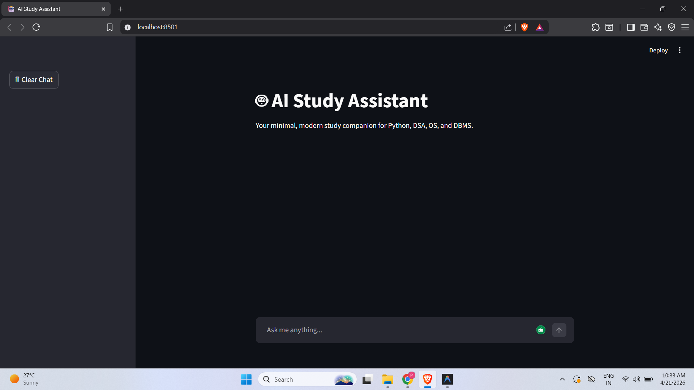
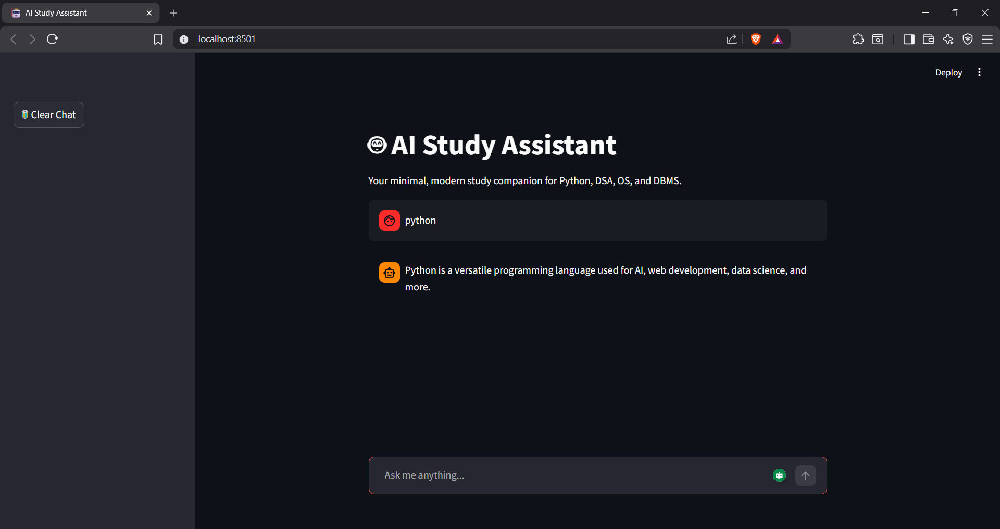
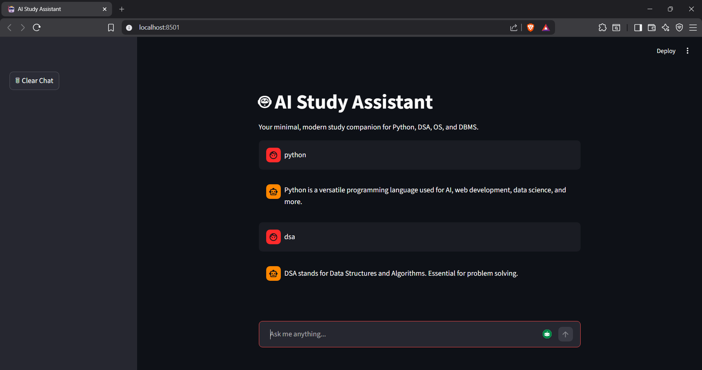

🤖 AI Study Assistant Chatbot

An interactive AI-powered chatbot built using Streamlit + Groq LLM API that helps students learn core Computer Science subjects like Python, DSA, OS, and DBMS with clean, structured explanations.

🚀 Features
💬 ChatGPT-style UI (modern chat layout)
🧠 LLM-powered intelligent responses
📝 Well-formatted answers (headings, bullet points)
⚡ Typing animation for realistic interaction
🗑 Clear chat functionality
📚 Focused academic assistance
🎨 Custom UI (user right, bot full-width)

🛠️ Tech Stack
Python
Streamlit
Groq API (LLM - Llama 3.1)
HTML + CSS (for custom UI styling)

▶️ Run Locally
1. Clone the repository
git clone https://github.com/maniac-24/AI-Study-Assistant-Chatbot.git
cd AI-Study-Assistant-Chatbot
2. Create virtual environment
python -m venv .venv
.venv\Scripts\activate
3. Install dependencies
pip install -r requirements.txt
4. Set API key
Create a .env file:
GROQ_API_KEY=your_api_key_here
5. Run the app
streamlit run app.py

📸 Demo
 
 

📅 Development Progress
✅ Day 1: Basic chatbot logic
✅ Day 2: Chat UI + session memory
✅ Day 3: Typing animation
✅ Day 4: API integration (Groq LLM)
✅ Day 5: Clean UI + Markdown formatted responses

🔐 Environment Variables
Variable	Description
GROQ_API_KEY	Your Groq API key
📌 Future Improvements
📄 PDF-based Q&A (RAG)
🧠 Memory-based conversations
🌐 Multi-language support
🎙 Voice input/output
☁️ Deployment (Streamlit Cloud / Render)

👨‍💻 Author
Prashanth M

⭐ Support

If you like this project:
👉 Give it a star ⭐ on GitHub
👉 Share it with others
